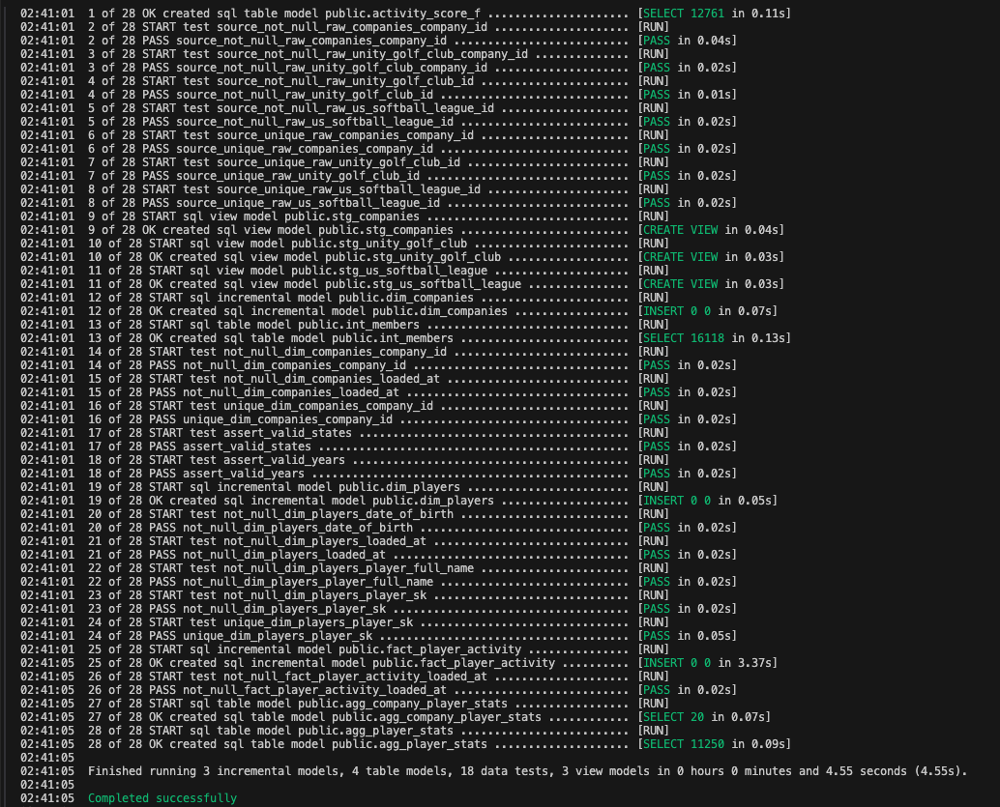
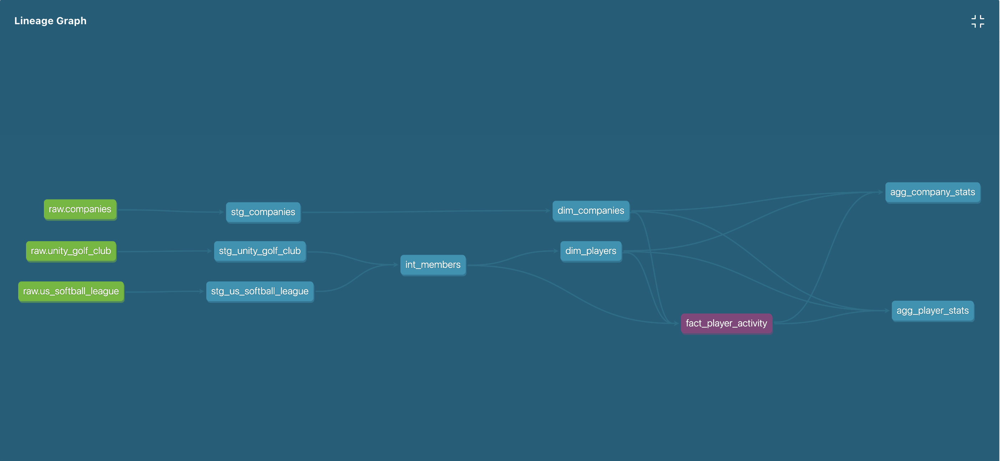

# Hinge Health Analytics Engineer Take Home DBT Project

This project combines and analyzes membership data from US Softball League and Unity Golf Club using dbt.

## Prerequisites

- Python 3.9 or above
- Pipenv
- Git
- PostgreSQL

## Project Structure

```
hinge-health-exercise/
├── .git/
├── .gitignore
├── .pre-commit-config.yaml
├── .flake8
├── Pipfile
├── README.md
├── dbt_project.yml
├── seeds/
│   ├── companies.txt
│   ├── unity_golf_club.txt
│   └── us_softball_league.txt
├── models/
│   ├── staging/
│   │   ├── stg_companies.sql
│   │   ├── stg_us_softball_league.sql
│   │   └── stg_unity_golf_club.sql
│   ├── intermediate/
│   │   └── int_members.sql
│   ├── marts/
│   │   ── dimensions/
|   |       |── dim_companies.sql
|   |       |── dim_companies.yml
|   |       |── dim_players.sql
|   |       |── dim_players.yml
│   │   ── facts/
|   |       |── fact_player_activity.sql
|   |       |── fact_player_activity.yml
|   |   |── agg_company_stats.sql
|   |   |── agg_player_stats.sql
|   |   |── metrics.yml
├── macros/
│   └── state_name_to_abbreviation.sql
└── tests/
    ├── assert_valid_years.sql
    ├── assert_valid_states.sql
```

## Installation

1. Clone the repository:
```bash
gh repo clone rajesh-veera/hinge-health-exercise
cd hinge-health-exercise
```

2. Install dependencies using Pipenv:
```bash
# Install Pipenv if you haven't already
pip install pipenv

# Install project dependencies
pipenv install --dev
```

3. Install pre-commit hooks:
```bash
pipenv run pre-commit install
```

## Configuration

1. Configure database connection by creating/editing `~/.dbt/profiles.yml`:
```yaml
hinge_health_dbt:
  target: dev
  outputs:
    dev:
      type: postgres
      host: localhost
      port: 5432
      user: your_user
      password: your_password
      dbname: your_database
      schema: your_schema
      threads: 4
```

2. Place your data files in the `ingest` directory:
```python
python load_data.py
```

## Usage

1. Activate the virtual environment:
```bash
pipenv shell
```

2. Run dbt models:
```bash
# Run all models
dbt run
```
3. Run tests:
```bash
# Run all tests
dbt test
```
4. Run manual checks:
```bash
# Format code
pipenv run black .

# Run linting
pipenv run flake8 .

# Run all pre-commit checks manually
pipenv run pre-commit run --all-files
```

## Project Tests
   

## Project Lineage
   

## Pre-commit Hooks

The following checks run automatically on commit:
- Code formatting (Black)
- Trailing whitespace removal
- File ending fixes

## Additional Resources

- Learn more about dbt [in the docs](https://docs.getdbt.com/docs/introduction)
- Check out [Discourse](https://discourse.getdbt.com/) for commonly asked questions and answers
- Join the [chat](https://community.getdbt.com/) on Slack for live discussions and support
- Find [dbt events](https://events.getdbt.com) near you
- Check out [the blog](https://blog.getdbt.com/) for the latest news on dbt's development and best practices
- Pipenv [Pipenv Documentation](https://pipenv.pypa.io/)
